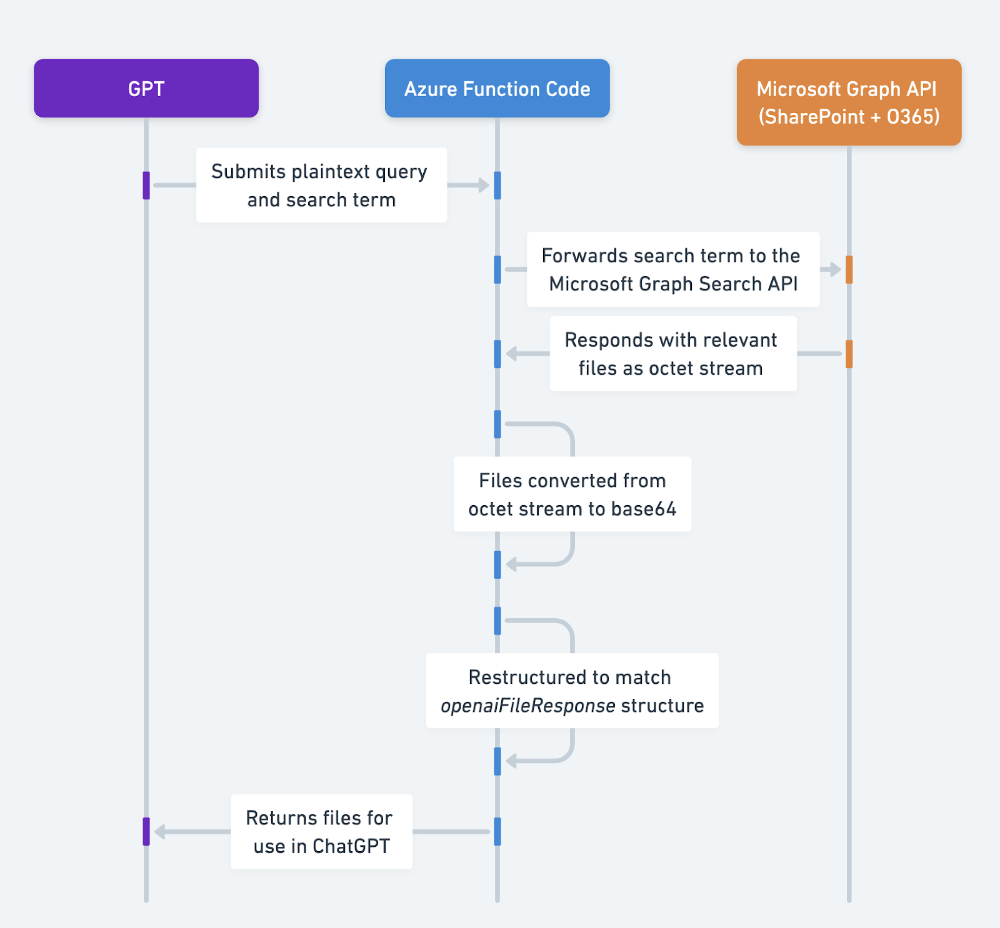
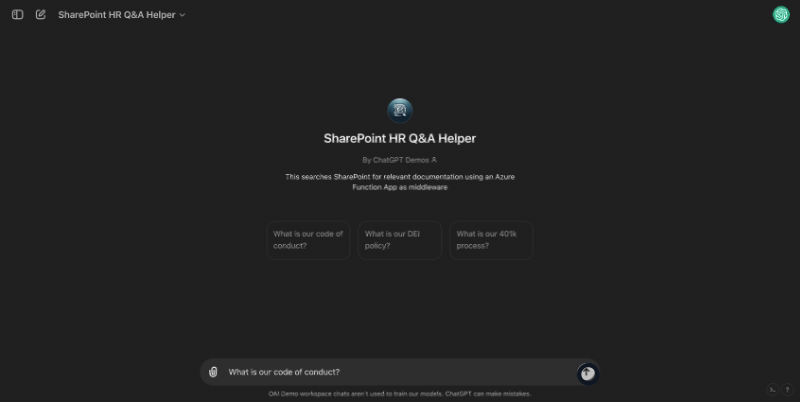
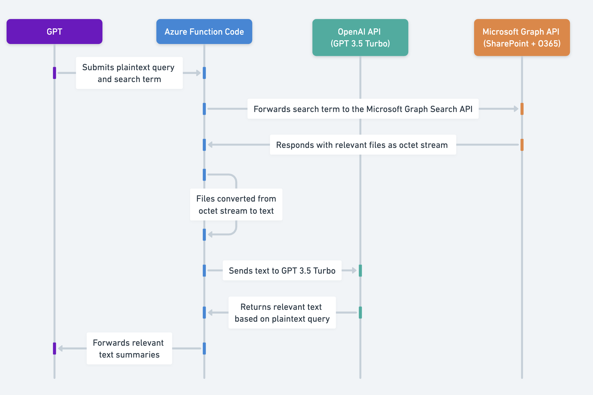
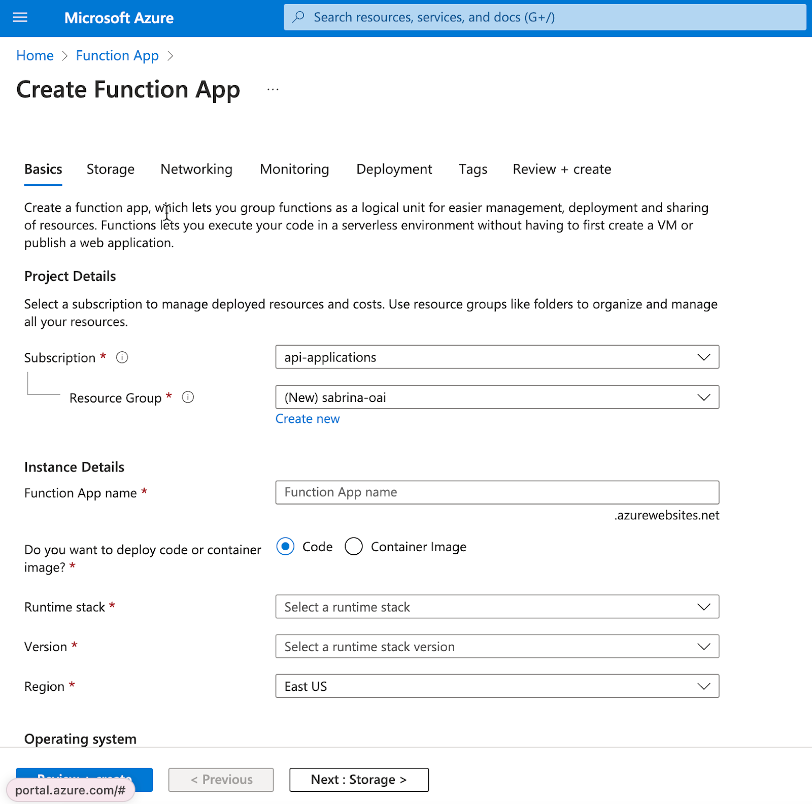
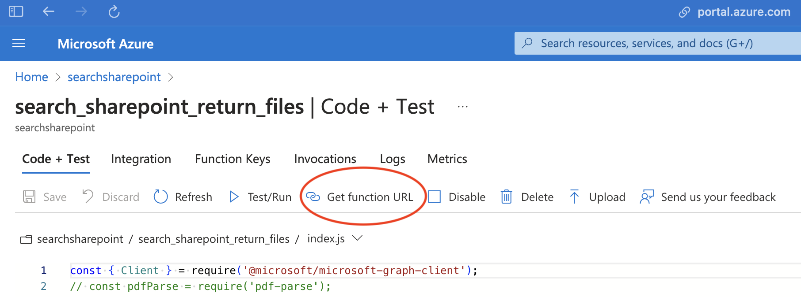

# 使用 Azure Functions 结合 OAuth 和 Microsoft Graph API 从 ChatGPT 搜索 O365 / SharePoint

## 概述

本解决方案使 GPT 动作能够根据用户在 SharePoint 或 Office365 中可访问的文件内容回答用户的问题，利用 Microsoft Graph API 的[搜索功能](https://learn.microsoft.com/en-us/graph/api/resources/search-api-overview?view=graph-rest-1.0)和[检索文件的能力](https://learn.microsoft.com/en-us/graph/api/driveitem-get?view=graph-rest-1.0&tabs=http)。它使用 Azure Functions 处理 Graph API 响应并将其转换为人类可读格式或以 ChatGPT 理解的方式结构化。此代码旨在提供方向性指导，您应根据需求进行修改。

## 工作原理

以下提供了两种解决方案，每种方案在仓库中都有相应的代码。

第一种解决方案 **解决方案 1** 利用[在动作中检索文件](https://platform.openai.com/docs/actions/getting-started/returning-files)的能力，并将其用作直接上传到对话中的文件。Azure Function 返回一个 base64 字符串，ChatGPT 将其转换为文件，处理方式与直接上传到对话中的文件相同。此解决方案可以处理比下面其他解决方案更多的文件类型，但存在大小限制（参见[文档](https://platform.openai.com/docs/actions/getting-started/returning-files)）。

第二种解决方案 **解决方案 2** 在 Azure Function 中预处理文件。Azure Function 返回文本，而不是 base64 编码的文件。由于预处理和转换为文本，此解决方案最适合用于大型非结构化文档，以及当您希望分析超过第一种解决方案支持的文件数量时（参见[文档](https://platform.openai.com/docs/actions/getting-started/returning-files)）。

### 解决方案 1：使用[返回文件](https://platform.openai.com/docs/actions/getting-started/returning-files)模式将文件返回给 GPT


此解决方案使用 Node.js Azure Function，根据登录用户：

1. 根据用户的初始问题搜索用户有权访问的相关文件。
2. 对于找到的每个文件，将其转换为 base64 字符串。
3. 以 ChatGPT 期望的结构格式化数据（参见[此处](https://platform.openai.com/docs/actions/getting-started/inline-option)）。
4. 将数据返回给 ChatGPT。GPT 随后可以将这些文件用作直接上传到对话中的文件。



### 解决方案 2：在 Azure Function 中将文件转换为文本



此解决方案使用 Node.js Azure Function，根据登录用户：

1. 根据用户的初始问题搜索用户有权访问的相关文件。
2. 对于找到的每个文件，将其转换为一致的可读格式并提取所有文本。
3. 使用 GPT 3.5-turbo（gpt-3.5-turbo-0125）根据用户的初始问题从文件中提取相关文本。注意 GPT 3.5 turbo 的定价（参见[此处](https://openai.com/pricing#language-models)）——由于我们处理的是小 token 块，这一步骤的成本是微不足道的。
4. 将数据返回给 ChatGPT。GPT 随后使用这些信息来回答用户的初始问题。

从下面的架构图可以看出，前三个步骤与解决方案 1 相同。主要区别在于此解决方案将文件转换为文本而不是 base64 字符串，然后使用 GPT 3.5 Turbo 总结该文本。



### 为什么需要这样做而不是直接与 Microsoft API 交互？

- 根据[此指南](https://learn.microsoft.com/en-us/graph/search-concept-files)，[Microsoft Graph Search API](https://learn.microsoft.com/en-us/graph/search-concept-files) 返回符合条件的文件引用，而不是文件内容本身。因此，我们需要有两种选择，对应于上述两种解决方案：

  - **解决方案 1：重构响应以实现兼容性：**
    1. 我们需要重构该 API 的响应，使其匹配 `openaiFileResponse` 中概述的预期结构（参见[此处](https://platform.openai.com/docs/actions/getting-started/inline-option)）。

  - **解决方案 2：直接从文件中提取文本：**
    1. 遍历返回的文件并使用[下载文件端点](https://learn.microsoft.com/en-us/graph/api/driveitem-get-content?view=graph-rest-1.0&tabs=http)或[转换文件端点](https://learn.microsoft.com/en-us/graph/api/driveitem-get-content-format?view=graph-rest-1.0&tabs=http)下载文件。
    2. 使用[pdf-parse](https://www.npmjs.com/package/pdf-parse)将二进制流转换为人类可读文本。
3. 接下来，我们可以通过在函数中使用gpt-3.5-turbo进行总结来进一步优化，以帮助我们今天对Actions施加的100,000字符限制。


## 前提条件

- 拥有创建Azure Function Apps和Azure Entra App注册权限的Azure门户

- Postman（以及对API和OAuth的了解）

- _仅限解决方案2：_ 来自platform.openai.com的OpenAI API密钥


## 解决方案1 + 解决方案2 安装指南

以下是设置带有身份验证的Azure函数的指南。请确保在实施代码之前遵循这些步骤。

> 这些安装指南适用于解决方案1和解决方案2。我们鼓励在同一个Function App中设置两个解决方案作为单独的函数，以测试哪个最适合您，因为一旦设置了一个函数，在同一个函数应用中设置另一个函数只需几分钟。


### 安装应用

您可以在文档左侧了解更多关于Azure函数的语言和部署选项[这里](https://learn.microsoft.com/en-us/azure/azure-functions/functions-overview?pivots=programming-language-csharp)。


#### 选项1：使用VSCode

请参阅Microsoft的文档[这里](https://learn.microsoft.com/en-us/azure/azure-functions/functions-develop-vs-code?tabs=node-v4,python-v2,isolated-process&pivots=programming-language-javascript)了解如何使用VSCode进行部署。如果您熟悉这种方法，请随意使用。


#### 选项2：直接在Azure门户中

请参阅文档[这里](https://learn.microsoft.com/en-us/azure/azure-functions/functions-create-function-app-portal?pivots=programming-language-javascript)了解如何使用Azure门户进行部署。我们将在这里一步步进行示例说明。

> 注意：您可以使用下面的第1部分至第4部分来设置任何带有Entra身份验证的Azure Function App。


##### 第1部分：创建函数





1. 创建一个[Azure Function应用](https://learn.microsoft.com/en-us/azure/azure-functions/functions-overview?pivots=programming-language-csharp)。我使用了以下设置，但您可以使用任何您熟悉的设置。请注意，并非每种语言/操作系统都允许直接在控制台中编辑函数——我选择的组合可以。在我的演示中，我将所有内容保留为默认设置，并做出了以下选择：

   1. 基础

      1. _您想部署代码还是容器镜像？：_ **代码**

      2. _运行时堆栈：_ **Node.js**

      3. _操作系统：_ **Windows**

   2. 网络

      1. _启用公共访问：_ **开启（需要连接到GPT）**

2. 完成上述步骤后，您将进入“部署”页面。一旦部署完成（应该只需要几分钟），点击**“转到资源”**返回Function App。

  > 您第一次尝试时可能会遇到错误，再次点击创建，很可能会成功。


##### 第2部分：设置身份验证

3. 在Azure Function App的左侧菜单中，点击**设置**菜单下的**身份验证**。

   1. 添加身份提供者

   2. 选择**Microsoft**作为身份提供者。

   3. **工作力**作为租户类型

   4. **创建一个新应用程序。**如果您使用现有应用程序，步骤大致相似，但创建新应用程序更容易，因为它会自动使用“Easy Auth”暴露回调URL和API。您可以阅读更多相关信息[**这里**](https://learn.microsoft.com/en-us/azure/app-service/overview-authentication-authorization)。

   5. 将此页面上的所有其他设置保留为默认值，但根据您的内部指南自由更改。

   6. 在**权限**标签页，点击**添加权限**并添加**Files.Read.All**和**Sites.ReadAll**，然后**添加**。这允许该应用程序读取文件，这对于使用Microsoft Graph搜索API非常重要。

4. 创建完成后，**点击您刚刚创建的企业应用程序**（即，离开Function App页面，进入您刚刚创建的企业应用程序页面）。我们现在将给它添加一个额外的权限，即通过模拟登录应用程序的用户来执行Azure函数。更多详情请参阅[这里](https://learn.microsoft.com/en-us/azure/app-service/configure-authentication-provider-aad?tabs=workforce-tenant)。

   1. 在主页上，点击“**查看API权限**”

   2. 在**我的组织使用的API**中搜索**Microsoft Azure App Service**并找到**user_impersonation**

   3. 添加它，然后您需要Azure门户上的管理员**授予管理员同意**。
5) **在企业应用程序中**，点击左侧菜单下**“管理”**中的**“公开API”**，然后使用**“复制到剪贴板”**按钮复制创建的范围。范围应类似于“api://\<插入-uuid>/user\_impersonation”。**保存此内容以备后用**，记为 `SCOPE`。

6) 点击左侧菜单下**“管理”**中的**“身份验证”**

   1. 在**Web**部分下，你会注意到一个回调URI已自动添加。添加Postman的重定向URI（<https://oauth.pstmn.io/v1/callback>）用于测试。

7) 在左侧，进入**概览**。复制**应用程序（客户端）ID**和**目录（租户）ID**，并**保存以备后用**，分别记为 `CLIENT_ID` 和 `TENANT_ID`。

##### 第三部分：设置测试函数

8. 离开页面，回到主页，然后返回你的**函数应用**。

9. 点击**创建函数**。在这个例子中，我将在门户中开发它，但你也可以使用VSCode或其他IDE。

   1. 选择**HTTP触发器**

   2. 对于**授权级别**，你可以选择任何你想要的密钥类型。

      1. 注意这可能会在第一次出错，但函数很可能已经创建，刷新页面检查一下。

10. 点击你刚刚创建的函数（你可能需要点击刷新才能看到它）。点击**获取函数URL**并保存，以便在Postman中测试。稍后创建OpenAPI规范时，你也会用到这个URL。



11. 返回函数应用并点击**配置**。显示 `MICROSOFT_PROVIDER_AUTHENTICATION_SECRET` 变量的值，复制它（点击高级编辑以复制），并**保存以备后用**。

至此，你应该已经创建了一个测试函数，并保存了**客户端ID、租户ID、密钥、范围和函数URL**。现在你可以准备在Postman中测试身份验证了。

##### 第四部分：在Postman中测试身份验证

12. 尝试在Postman中使用这些OAuth设置访问你创建的端点：

    1. **授权类型**：授权码

    2. **授权URL**：[https://login.microsoftonline.com/](about:blank)`TENANT_ID`[/oauth2/v2.0/authorize](about:blank)

    3. **令牌URL**：[https://login.microsoftonline.com/`TENANT_ID`/oauth2/v2.0/token](about:blank)

    4. **客户端ID**：来自步骤7的 `CLIENT_ID`

    5. **客户端密钥**：来自步骤11的 `MICROSOFT_PROVIDER_AUTHENTICATION_SECRET`

    6. **范围**：来自步骤5的 `SCOPE`

    7. **客户端凭据**：在请求体中发送客户端凭据

13. 你需要点击**获取新访问令牌**，然后访问你在步骤10中保存的端点。如果成功，你应该会得到这个响应：`“This HTTP triggered function executed successfully. Pass a name in the query string or in the request body for a personalized response.”`

##### 第五部分：添加函数代码

现在你已经有一个经过身份验证的Azure函数，我们可以更新函数以搜索SharePoint/O365

14. 进入你的测试函数，从[这个文件](https://github.com/openai/openai-cookbook/blob/main/examples/chatgpt/sharepoint_azure_function/solution_one_file_retrieval.js)粘贴解决方案1的代码，以及从[这个文件](https://github.com/openai/openai-cookbook/blob/main/examples/chatgpt/sharepoint_azure_function/solution_two_preprocessing.js)粘贴解决方案2的代码。保存函数。

> **这段代码旨在提供方向** - 虽然它应该开箱即用，但它设计为可根据你的需求进行定制（参见本文档末尾的示例）。

15. 通过进入左侧**设置**下的**配置**标签，设置以下环境变量。注意，这可能会直接列在**环境变量**中，具体取决于你的Azure UI。

    1. `TENANT_ID`：从前一部分复制

    2. `CLIENT_ID`：从前一部分复制

    3. _仅限解决方案2：_

       1. `OPENAI_API_KEY`：在platform.openai.com上创建一个OpenAI API密钥。

16. 进入**开发工具**下的**控制台**标签

    1. 在控制台中安装以下包

       1. `npm install @microsoft/microsoft-graph-client`

       2. `npm install axios`

       3. _仅限解决方案2：_

          1. `npm install pdf-parse`

          2. `npm install openai`

17. 完成后，再次从Postman调用函数（POST请求），将以下内容放入请求体（使用你认为会产生响应的查询和搜索词）。

    *解决方案1*：
    ```json
    {
        "searchTerm": "<选择一个搜索词>"
    }
    ```
    *解决方案2*：
    ```json
    {
        "query": "<选择一个问题>",
        "searchTerm": "<选择一个搜索词>"
    }
    ```
18. 如果你得到响应，你就可以准备将这个设置为自定义GPT了！

##### 第六部分：在自定义GPT中设置

19. 为你的端点生成一个OpenAPI规范。
20. 将该代码粘贴到 GPT 的 Actions 部分，并选择 OAuth 作为认证类型。按照上述 Postman 的设置方式填写 OAuth 设置。

21. 保存操作后，你会在 GPT 配置底部看到一个回调 URI。复制该 URL，然后返回 **Azure 门户中的 Function App**。

22. 点击 **设置** 下的 **认证**，然后点击你的 Entra 应用程序。

23. 进入后，点击 **管理** 部分的 **认证**。

24. 在该页面的 **Web** 部分添加一个新的重定向 URI，并粘贴从第 20 步获得的回调 URI，然后点击保存。

25. 自定义提示以使用此操作。你可以在本文件的示例 GPT 说明中看到一个示例提示，该提示定制为通过更改 searchTerm 尝试三次以找到答案。

26. 测试 GPT，它应该按预期工作。

## 解决方案 1 详细步骤：使用 [返回文件](https://platform.openai.com/docs/actions/getting-started/returning-files) 模式将文件返回给 GPT

以下是针对此解决方案的独特设置说明和步骤。你可以在 [这里](https://github.com/openai/openai-cookbook/blob/main/examples/chatgpt/sharepoint_azure_function/solution_one_file_retrieval.js) 找到完整的代码。如果你对解决方案 2 感兴趣，可以跳转到 [这里](#solution-2-converting-the-file-to-text-in-the-azure-function-1)。

### 代码详解

以下是对函数不同部分的详细说明。在开始之前，请确保已安装所需的包并设置好环境变量（参见安装步骤部分）。

#### 实现认证

下面我们有一些将在函数中使用的辅助函数。

##### 初始化 Microsoft Graph 客户端

创建一个函数，用访问令牌初始化 Graph 客户端。这将用于搜索 Office 365 和 SharePoint。

```javascript
const { Client } = require('@microsoft/microsoft-graph-client');

function initGraphClient(accessToken) {
    return Client.init({
        authProvider: (done) => {
            done(null, accessToken);
        }
    });
}
```

##### 获取代表（OBO）令牌

此函数使用现有的承载令牌从 Microsoft 的身份平台请求 OBO 令牌。这使得可以通过传递凭据来确保搜索仅返回登录用户可以访问的文件。

```javascript
const axios = require('axios');
const qs = require('querystring');

async function getOboToken(userAccessToken) {
    const { TENANT_ID, CLIENT_ID, MICROSOFT_PROVIDER_AUTHENTICATION_SECRET } = process.env;
    const params = {
        client_id: CLIENT_ID,
        client_secret: MICROSOFT_PROVIDER_AUTHENTICATION_SECRET,
        grant_type: 'urn:ietf:params:oauth:grant-type:jwt-bearer',
        assertion: userAccessToken,
        requested_token_use: 'on_behalf_of',
        scope: 'https://graph.microsoft.com/.default'
    };

    const url = `https://login.microsoftonline.com/${TENANT_ID}/oauth2/v2.0/token`;
    try {
        const response = await axios.post(url, qs.stringify(params), {
            headers: { 'Content-Type': 'application/x-www-form-urlencoded' }
        });
        return response.data.access_token;
    } catch (error) {
        console.error('Error obtaining OBO token:', error.response?.data || error.message);
        throw error;
    }
}
```

#### 从 O365 / SharePoint 项目中检索内容

此函数获取驱动器项目的内容，将其转换为 base64 字符串，并重新构造以匹配 `openaiFileResponse` 格式。

```javascript
const getDriveItemContent = async (client, driveId, itemId, name) => {
   try {
       const filePath = `/drives/${driveId}/items/${itemId}`;
       const downloadPath = filePath + `/content`;
       // 这里我们获取内容并转换为 base64
       const fileStream = await client.api(downloadPath).getStream();
       let chunks = [];
           for await (let chunk of fileStream) {
               chunks.push(chunk);
           }
       const base64String = Buffer.concat(chunks).toString('base64');
       // 这里我们获取其他元数据以包含在响应中
       const file = await client.api(filePath).get();
       const mime_type = file.file.mimeType;
       const name = file.name;
       return {"name": name, "mime_type": mime_type, "content": base64String};
   } catch (error) {
       console.error('Error fetching drive content:', error);
       throw new Error(`Failed to fetch content for ${name}: ${error.message}`);
   }
}
```

#### 创建处理请求的 Azure 函数

现在我们有了所有这些辅助函数，Azure 函数将协调流程，通过认证用户、执行搜索并迭代搜索结果以提取文本并检索相关文本部分返回给 GPT。
**处理HTTP请求：** 函数首先从HTTP请求中提取查询和搜索词。它检查是否存在Authorization头并提取承载令牌。

**身份验证：** 使用承载令牌，它通过上述定义的getOboToken从微软的身份平台获取OBO令牌。

**初始化Graph客户端：** 使用OBO令牌，它通过上述定义的initGraphClient初始化微软Graph客户端。

**文档搜索：** 它构建一个搜索查询并将其发送到微软Graph API，根据搜索词查找文档。

**文档处理：** 对于搜索返回的每个文档：

- 它使用getDriveItemContent检索文档内容。

- 它将文档转换为base64字符串并重新构造以匹配`openaiFileResponse`结构。

**响应：** 函数将它们发送回HTTP响应。
```javascript
module.exports = async function (context, req) {
   // const query = req.query.query || (req.body && req.body.query);
   const searchTerm = req.query.searchTerm || (req.body && req.body.searchTerm);
   if (!req.headers.authorization) {
       context.res = {
           status: 400,
           body: 'Authorization header is missing'
       };
       return;
   }
   /// 以下部分使用传递给函数的令牌，以获取OBO令牌。
   const bearerToken = req.headers.authorization.split(' ')[1];
   let accessToken;
   try {
       accessToken = await getOboToken(bearerToken);
   } catch (error) {
       context.res = {
           status: 500,
           body: `Failed to obtain OBO token: ${error.message}`
       };
       return;
   }
   // 使用上述定义的initGraphClient函数初始化Graph客户端
   let client = initGraphClient(accessToken);
   // 这是用于微软Graph搜索API的搜索体：https://learn.microsoft.com/en-us/graph/search-concept-files
   const requestBody = {
       requests: [
           {
               entityTypes: ['driveItem'],
               query: {
                   queryString: searchTerm
               },
               from: 0,
               // 以下设置为总结Graph API的前10个搜索结果，但可以根据您的文档进行配置。
               size: 10
           }
       ]
   };


   try {
       // 这是我们进行搜索的地方
       const list = await client.api('/search/query').post(requestBody);
       const processList = async () => {
           // 这将遍历每个搜索响应，抓取文件内容并使用gpt-3.5-turbo进行总结
           const results = [];
           await Promise.all(list.value[0].hitsContainers.map(async (container) => {
               for (const hit of container.hits) {
                   if (hit.resource["@odata.type"] === "#microsoft.graph.driveItem") {
                       const { name, id } = hit.resource;
                       // 以下是文件所在位置
                       const driveId = hit.resource.parentReference.driveId;
                       // 我们使用上述定义的辅助函数获取内容，转换为base64，并重新构造
                       const contents = await getDriveItemContent(client, driveId, id, name);
                       results.push(contents)
               }
           }));
           return results;
       };
       let results;
       if (list.value[0].hitsContainers[0].total == 0) {
           // 如果微软Graph API未返回结果，则向API返回未找到结果
           results = 'No results found';
       } else {
           // 如果微软Graph API返回结果，则运行processList进行遍历。
           results = await processList();
           // 这是我们构造响应的地方，以便ChatGPT知道它们是文件
           results = {'openaiFileResponse': results}
       }
       context.res = {
           status: 200,
           body: results
       };
   } catch (error) {
       context.res = {
           status: 500,
           body: `Error performing search or processing results: ${error.message}`,
       };
   }
};
```
### 自定义

以下是一些潜在的自定义区域。

- 您可以自定义GPT提示，如果在未找到任何内容时再次搜索一定次数。

- 您可以自定义代码，仅搜索特定的SharePoint站点或O365驱动器，通过自定义搜索查询。这将有助于聚焦搜索并改进检索。当前设置的函数会搜索登录用户可以访问的所有文件。

- 您可以更新代码，仅返回特定类型的文件。例如，仅返回结构化数据/CSV文件。

- 您可以自定义在调用微软Graph时搜索的文件数量。请注意，根据文档[此处](https://platform.openai.com/docs/actions/getting-started)，您应仅放置最多10个文件。
### 注意事项

请注意，这里同样适用 Actions 的所有限制，包括返回字符数不超过 10 万字符和 [45 秒超时](https://platform.openai.com/docs/actions/production/timeouts)。

- 确保阅读有关 [返回文件](https://platform.openai.com/docs/actions/getting-started/returning-files) 和 [文件上传](https://help.openai.com/en/articles/8555545-file-uploads-faq) 的文档，因为这些限制同样适用。

### 示例 GPT 指令

```text
你是一个问答助手，帮助用户解答问题。你可以通过 API 操作访问一个文档库。当用户提出问题时，你传入一个 "searchTerm"，即你认为应该用于搜索的单个关键词或术语。

****

场景 1：有答案

如果你的操作返回了结果，那么你就根据操作结果尝试回答用户的问题。

****

场景 2：未找到结果

如果操作返回的结果是 "未找到结果"，就此停止并告知用户没有找到结果，你将尝试使用不同的搜索词，并解释原因。在进行另一次搜索前，你必须始终告知用户。

示例：

****

对于 "DEI" 未找到结果。我现在将尝试 [插入术语] 因为 [插入解释]

****

然后，尝试一个与你之前尝试的术语相似的单个词。

尝试三次。第三次之后，告知用户你未找到任何相关文档来回答问题，并建议检查 SharePoint。
在每一步都要明确你正在搜索的内容。

****

在任一情况下，尝试回答用户的问题。如果你无法根据找到的知识回答用户的问题，告知用户并建议他们去检查 SharePoint 中的人力资源文档。
```

### 示例 OpenAPI 规范

这期望一个符合我们文档中文件检索结构的响应，并传入一个 `searchTerm` 参数以指导搜索。
>确保根据截图 [此处](#part-3-set-up-test-function) 链接中的内容，切换函数应用名称、函数名称和代码。

```yaml
openapi: 3.0.0
info:
  title: SharePoint 搜索 API
  description: 用于搜索 SharePoint 文档的 API。
  version: 1.0.0
servers:
  - url: https://{your_function_app_name}.azurewebsites.net/api
    description: SharePoint 搜索 API 服务器
paths:
  /{your_function_name}?code={enter your specific endpoint id here}:
    post:
      operationId: searchSharePoint
      summary: 根据查询和术语搜索 SharePoint 中的文档。
      requestBody:
        required: true
        content:
          application/json:
            schema:
              type: object
              properties:
                searchTerm:
                  type: string
                  description: 在文档中搜索的特定术语。
      responses:
        '200':
          description: 以 base64 编码的查询结果 CSV 文件。
          content:
            application/json:
              schema:
                type: object
                properties:
                  openaiFileResponseData:
                    type: array
                    items:
                      type: object
                      properties:
                        name:
                          type: string
                          description: 文件名称。
                        mime_type:
                          type: string
                          description: 文件的 MIME 类型。
                        content:
                          type: string
                          format: byte
                          description: 以 base64 编码的文件内容。
        '400':
          description: SQL 查询参数缺失时的错误请求。
        '413':
          description: 响应超过大小限制时的负载过大错误。
        '500':
          description: 执行查询或编码结果时出现问题的服务器错误。
```

## 解决方案 2 详细步骤：在 Azure 函数中将文件转换为文本

以下步骤详细介绍了针对此解决方案的设置说明和操作流程，即在 Azure 函数中预处理文件并提取摘要。你可以在 [这里](https://github.com/openai/openai-cookbook/blob/main/examples/chatgpt/sharepoint_azure_function/solution_two_preprocessing.js) 找到完整代码。

### 代码详解

#### 实现身份验证

此解决方案遵循与解决方案 1 相同的身份验证步骤 - 参见 [初始化 Microsoft Graph 客户端](#initializing-the-microsoft-graph-client) 和 [获取代表 (OBO) 令牌](#obtaining-an-on-behalf-of-obo-token) 部分。

#### 从 O365 / SharePoint 项目中检索内容
此函数用于获取驱动器项的内容，处理不同文件类型，并在必要时将文件转换为PDF以便进行文本提取。该函数使用 [下载端点](https://learn.microsoft.com/en-us/graph/api/driveitem-get-content?view=graph-rest-1.0\&tabs=http) 获取PDF文件内容，以及使用 [转换端点](https://learn.microsoft.com/en-us/graph/api/driveitem-get-content-format?view=graph-rest-1.0\&tabs=http) 获取其他支持文件类型的内容。

```javascript
const getDriveItemContent = async (client, driveId, itemId, name) => {
    try {
        const fileType = path.extname(name).toLowerCase();
        // 以下文件类型是可以转换为PDF以提取文本的类型。详见 https://learn.microsoft.com/en-us/graph/api/driveitem-get-content-format?view=graph-rest-1.0&tabs=http
        const allowedFileTypes = ['.pdf', '.doc', '.docx', '.odp', '.ods', '.odt', '.pot', '.potm', '.potx', '.pps', '.ppsx', '.ppsxm', '.ppt', '.pptm', '.pptx', '.rtf'];
        // filePath 根据文件类型变化，添加 ?format=pdf 将非PDF类型转换为PDF以提取文本，因此上述所有 allowedFileTypes 中的文件都会被转换为PDF
        const filePath = `/drives/${driveId}/items/${itemId}/content` + ((fileType === '.pdf' || fileType === '.txt' || fileType === '.csv') ? '' : '?format=pdf');
        if (allowedFileTypes.includes(fileType)) {
            response = await client.api(filePath).getStream();
            // 以下代码将响应中的数据块合并
            let chunks = [];
            for await (let chunk of response) {
                chunks.push(chunk);
            }
            let buffer = Buffer.concat(chunks);
            // 以下代码从PDF中提取文本
            const pdfContents = await pdfParse(buffer);
            return pdfContents.text;
        } else if (fileType === '.txt') {
            // 如果文件类型是txt，则无需创建流，直接获取内容
            response = await client.api(filePath).get();
            return response;
        }  else if (fileType === '.csv') {
            response = await client.api(filePath).getStream();
            let chunks = [];
            for await (let chunk of response) {
                chunks.push(chunk);
            }
            let buffer = Buffer.concat(chunks);
            let dataString = buffer.toString('utf-8');
            return dataString
            
    } else {
        return 'Unsupported File Type';
    }
     
    } catch (error) {
        console.error('Error fetching drive content:', error);
        throw new Error(`Failed to fetch content for ${name}: ${error.message}`);
    }
};
```

#### 集成 GPT 3.5-Turbo 进行文本分析

此函数利用 OpenAI SDK 分析从文档中提取的文本，并根据用户查询找到相关信息。这有助于确保仅将与用户问题相关的文本返回给 GPT。

```javascript
const getRelevantParts = async (text, query) => {
    try {
        // 我们使用您的 OpenAI 密钥初始化 OpenAI 客户端
        const openAIKey = process.env["OPENAI_API_KEY"];
        const openai = new OpenAI({
            apiKey: openAIKey,
        });
        const response = await openai.chat.completions.create({
            // 使用 gpt-3.5-turbo 模型以提高速度，防止超时。您可以根据需要调整此提示
            model: "gpt-3.5-turbo-0125",
            messages: [
                {"role": "system", "content": "您是一个有用的助手，根据查询在文本中找到相关内容。您只返回相关句子，最多返回10个句子"},
                {"role": "user", "content": `基于这个问题：**"${query}"**，从以下文本中获取相关部分：*****\n\n${text}*****. 如果无法根据文本回答问题，请回复 'No information provided'`}
            ],
            // 使用温度值0，因为我们只想提取相关内容
            temperature: 0,
            // 使用最大令牌数1000，但您可以根据搜索的文档数量自定义此值
            max_tokens: 1000
        });
        return response.choices[0].message.content;
    } catch (error) {
        console.error('Error with OpenAI:', error);
        return 'Error processing text with OpenAI' + error;
    }
};
```

#### 创建处理请求的 Azure 函数

现在我们已经有了所有这些辅助函数，Azure 函数将协调流程，通过验证用户身份、执行搜索，并遍历搜索结果以提取文本并检索与 GPT 相关的文本部分。

**处理 HTTP 请求：** 该函数首先从 HTTP 请求中提取查询和搜索词。它检查 Authorization 头是否存在并提取承载令牌。
**身份验证：** 使用承载令牌，它通过上述定义的 getOboToken 从微软的身份平台获取一个 OBO 令牌。

**初始化 Graph 客户端：** 利用 OBO 令牌，它通过上述定义的 initGraphClient 初始化微软 Graph 客户端。

**文档搜索：** 它构建一个搜索查询，并将其发送到微软 Graph API，根据 searchTerm 查找文档。

**文档处理：** 对于搜索返回的每个文档：

- 它使用 getDriveItemContent 获取文档内容。

- 如果文件类型受支持，它使用 getRelevantParts 分析内容，该方法将文本发送到 OpenAI 的模型，根据查询提取相关信息。

- 它收集分析结果，并包含文档名称和 URL 等元数据。

**响应：** 该函数按相关性对结果进行排序，并在 HTTP 响应中发送回这些结果。
```javascript
module.exports = async function (context, req) {
    const query = req.query.query || (req.body && req.body.query);
    const searchTerm = req.query.searchTerm || (req.body && req.body.searchTerm);
    if (!req.headers.authorization) {
        context.res = {
            status: 400,
            body: 'Authorization header is missing'
        };
        return;
    }
    /// 以下代码使用传递给函数的令牌来获取 OBO 令牌。
    const bearerToken = req.headers.authorization.split(' ')[1];
    let accessToken;
    try {
        accessToken = await getOboToken(bearerToken);
    } catch (error) {
        context.res = {
            status: 500,
            body: `Failed to obtain OBO token: ${error.message}`
        };
        return;
    }
    // 使用上面定义的 initGraphClient 函数初始化 Graph 客户端
    let client = initGraphClient(accessToken);
    // 这是用于 Microsoft Graph 搜索 API 的搜索体：https://learn.microsoft.com/en-us/graph/search-concept-files
    const requestBody = {
        requests: [
            {
                entityTypes: ['driveItem'],
                query: {
                    queryString: searchTerm
                },
                from: 0,
                // 以下设置用于汇总 Graph API 的前 10 个搜索结果，但可以根据您的文档进行配置。
                size: 10
            }
        ]
    };

    try { 
        // 函数用于对内容进行分词（例如，基于单词）。
        const tokenizeContent = (content) => {
            return content.split(/\s+/);
        };

        // 函数用于将令牌分成 10k 令牌窗口，供 gpt-3.5-turbo 使用
        const breakIntoTokenWindows = (tokens) => {
            const tokenWindows = []
            const maxWindowTokens = 10000; // 10k 令牌
            let startIndex = 0;

            while (startIndex < tokens.length) {
                const window = tokens.slice(startIndex, startIndex + maxWindowTokens);
                tokenWindows.push(window);
                startIndex += maxWindowTokens;
            }

            return tokenWindows;
        };
        // 这是我们进行搜索的地方
        const list = await client.api('/search/query').post(requestBody);

        const processList = async () => {
            // 这将遍历每个搜索响应，抓取文件内容并使用 gpt-3.5-turbo 进行汇总
            const results = [];

            await Promise.all(list.value[0].hitsContainers.map(async (container) => {
                for (const hit of container.hits) {
                    if (hit.resource["@odata.type"] === "#microsoft.graph.driveItem") {
                        const { name, id } = hit.resource;
                        // 我们使用以下内容抓取文件的 URL 以包含在响应中
                        const webUrl = hit.resource.webUrl.replace(/\s/g, "%20");
                        // Microsoft Graph API 对响应进行排名，因此我们使用此项进行排序
                        const rank = hit.rank;
                        // 以下是文件所在的位置
                        const driveId = hit.resource.parentReference.driveId;
                        const contents = await getDriveItemContent(client, driveId, id, name);
                        if (contents !== 'Unsupported File Type') {
                            // 使用之前定义的函数对内容进行分词
                            const tokens = tokenizeContent(contents);

                            // 将令牌分成 10k 令牌窗口
                            const tokenWindows = breakIntoTokenWindows(tokens);

                            // 处理每个令牌窗口并合并结果
                            const relevantPartsPromises = tokenWindows.map(window => getRelevantParts(window.join(' '), query));
                            const relevantParts = await Promise.all(relevantPartsPromises);
                            const combinedResults = relevantParts.join('\n'); // 合并结果

                            results.push({ name, webUrl, rank, contents: combinedResults });
                        } 
                        else {
                            results.push({ name, webUrl, rank, contents: 'Unsupported File Type' });
                        }
                    }
                }
            }));

            return results;
        };
        let results;
        if (list.value[0].hitsContainers[0].total == 0) {
            // 如果 Microsoft Graph API 未返回结果，则向 API 返回未找到结果
            results = 'No results found';
        } else {
            // 如果 Microsoft Graph API 返回结果，则运行 processList 进行遍历。
            results = await processList();
            results.sort((a, b) => a.rank - b.rank);
        }
        context.res = {
            status: 200,
            body: results
        };
    } catch (error) {
        context.res = {
            status: 500,
            body: `Error performing search or processing results: ${error.message}`,
        };
    }
};
```
### 自定义选项

以下是一些可以自定义的潜在领域：

- 您可以自定义 GPT 提示，如果在一定次数内未找到任何内容，则重新搜索。

- 您可以通过自定义搜索查询，使代码仅搜索特定的 SharePoint 站点或 O365 驱动器。这将有助于集中搜索并提高检索效率。目前设置的功能会遍历登录用户可以访问的所有文件。

- 您可以使用 gpt-4o 而不是 gpt-3.5 turbo 以获得更长的上下文。这会稍微增加成本和延迟，但您可能会获得更高质量的摘要。

- 您可以在调用 Microsoft Graph 时自定义搜索的文件数量。

### 注意事项

请注意，这里同样适用 Actions 的所有限制，包括返回不超过 10 万个字符以及 [45 秒超时](https://platform.openai.com/docs/actions/production/timeouts)。

- 这仅适用于文本，不适用于图像。通过在 Azure 函数中添加一些额外代码，您可以使用 GPT-4o 提取图像的摘要。

- 这不适用于结构化数据。如果结构化数据是您的主要用例，我们建议使用解决方案 1。

### 示例 GPT 指令

```
您是一个问答助手，帮助用户回答问题。您可以通过 API 操作访问文档库。当用户提出问题时，您将该问题原封不动地传递给 "query" 参数，对于 "searchTerm"，您使用一个您认为应该用于搜索的关键词或术语。

****

场景 1：有答案

如果您的操作返回结果，那么您从操作中获取结果，并结合从操作返回的 webUrl 进行简洁的总结。您根据操作中的知识尽可能好地回答用户的问题。

****

场景 2：未找到结果

如果从操作中得到的响应是 "未找到结果"，请停止并告知用户没有找到结果，并且您将尝试不同的搜索词，解释原因。在进行另一次搜索之前，您必须始终告知用户。

示例：

****

对于 "DEI" 未找到结果。我现在将尝试 [插入术语]，因为 [插入解释]

****

然后，尝试一个与之前尝试的术语相似的单个词。

尝试三次。第三次之后，告知用户您没有找到任何相关文档来回答问题，并请用户检查 SharePoint。确保在每一步都明确您正在搜索的内容。

****

在任一场景中，尽量回答用户的问题。如果您无法根据找到的知识回答用户的问题，请告知用户并请他们去检查 SharePoint 中的人力资源文档。如果文件是 CSV、XLSX 或 XLS，您可以告知用户使用链接下载文件并重新上传以使用高级数据分析。
```

### 示例 OpenAPI 规范

下面的规范通过 `query` 参数通知预处理，并通过 `searchTerm` 在 Microsoft Graph 中找到正确的文件。
>确保根据截图 [此处](#part-3-set-up-test-function) 复制链接，切换函数应用名称、函数名称和代码。

```yaml
openapi: 3.0.0
info:
  title: SharePoint 搜索 API
  description: 用于搜索 SharePoint 文档的 API。
  version: 1.0.0
servers:
  - url: https://{your_function_app_name}.azurewebsites.net/api
    description: SharePoint 搜索 API 服务器
paths:
  /{your_function_name}?code={enter your specific endpoint id here}:
    post:
      operationId: searchSharePoint
      summary: 根据查询和术语搜索 SharePoint 中的文档。
      requestBody:
        required: true
        content:
          application/json:
            schema:
              type: object
              properties:
                query:
                  type: string
                  description: 在 SharePoint 文档中搜索的完整查询。
                searchTerm:
                  type: string
                  description: 在文档中搜索的特定术语。
      responses:
        '200':
          description: 搜索结果
          content:
            application/json:
              schema:
                type: array
                items:
                  type: object
                  properties:
                    documentName:
                      type: string
                      description: 文档的名称。
                    snippet:
                      type: string
                      description: 包含搜索术语的文档片段。
                    url:
                      type: string
                      description: 访问文档的 URL。
```

## 常见问题

- 为什么在代码中使用 Microsoft Graph API 而不是 [SharePoint API](https://learn.microsoft.com/en-us/sharepoint/dev/sp-add-ins/get-to-know-the-sharepoint-rest-service?tabs=csom)？
- SharePoint API 已过时 - 根据微软的文档 [这里](https://learn.microsoft.com/en-us/sharepoint/dev/apis/sharepoint-rest-graph)，“对于 SharePoint Online，使用 REST API 的创新是通过 Microsoft Graph REST API 驱动的。” Graph API 提供了更多的灵活性，而 SharePoint API 仍然会遇到 [为什么需要这个而不是直接与 Microsoft Graph API 交互？](#why-is-this-necessary-instead-of-interacting-with-the-microsoft-api-directly) 部分中列出的相同文件问题。

- 这个支持哪些类型的文件？

  - _解决方案 1:_

    1. 它遵循与文件上传相关的文档 [这里](https://help.openai.com/en/articles/8555545-file-uploads-faq) 相同的指南。

  - _解决方案 2:_

    1. 这个支持 Convert File 端点文档 [这里](https://learn.microsoft.com/en-us/graph/api/driveitem-get-content-format?view=graph-rest-1.0&tabs=http) 中列出的所有文件。具体来说，它支持 _pdf, doc, docx, odp, ods, odt, pot, potm, potx, pps, ppsx, ppsxm, ppt, pptm, pptx, rtf_。

    2. 当搜索结果返回 XLS, XLSX 或 CSV 时，会提示用户下载文件并重新上传，以便使用高级数据分析提问。如上所述，如果结构化数据是您使用场景的一部分，我们推荐解决方案 1。

- 为什么我需要请求一个 OBO 令牌？

  - 当您尝试使用与验证 Azure Function 相同的令牌来验证 Graph API 时，会收到一个“无效受众”的令牌。这是因为令牌的受众只能是 user_impersonation。

  - 为了解决这个问题，该函数请求一个新的令牌，该令牌在应用程序中使用 [On Behalf Of 流程](https://learn.microsoft.com/en-us/entra/identity-platform/v2-oauth2-on-behalf-of-flow) 限定为 Files.Read.All。这将继承登录用户的权限，意味着该函数只会搜索登录用户有权访问的文件。

  - 我们故意在每次请求时请求一个新的 On Behalf Of 令牌，因为 Azure Function Apps 应该是无状态的。您可以将其与 Azure Key Vault 集成，以存储密钥并按需检索。