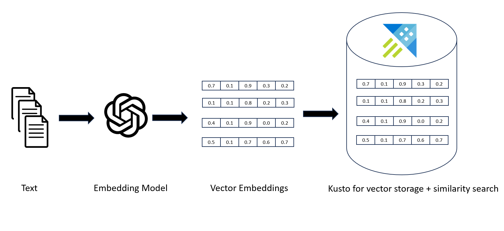
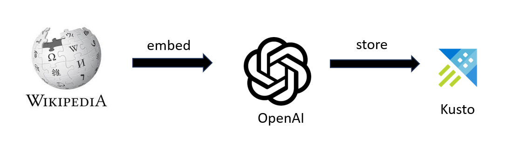
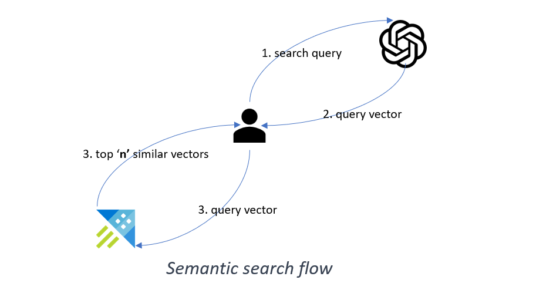

# Kusto 作为向量数据库

[Azure Data Explorer，又称 Kusto](https://azure.microsoft.com/en-us/products/data-explorer) 是一项基于云的数据分析服务，使用户能够对大型数据集进行实时高级分析。它特别擅长处理大量数据，是存储和搜索向量的绝佳选择。

Kusto 支持一种称为动态的特殊数据类型，可以存储数组和属性包等非结构化数据。[动态数据类型](https://learn.microsoft.com/en-us/azure/data-explorer/kusto/query/scalar-data-types/dynamic)非常适合存储向量值。您还可以通过将原始对象的相关元数据存储为表中的单独列来进一步增强向量值。Kusto 还支持内置函数 [series_cosine_similarity_fl](https://learn.microsoft.com/en-us/azure/data-explorer/kusto/functions-library/series-cosine-similarity-fl) 来执行向量相似性搜索。

[免费开始使用 Kusto](https://aka.ms/kustofree)。

## 开始使用 Kusto 和 Open AI 嵌入

### 演示场景

如果您想尝试这个演示，请按照 [Notebook](Getting_started_with_kusto_and_openai_embeddings.ipynb) 中的说明操作。

它将允许您 -  

1. 使用 OpenAI API 创建的预计算嵌入。

2. 将嵌入存储在 Kusto 中。

3. 使用 OpenAI API 将原始文本查询转换为嵌入。

4. 使用 Kusto 在存储的嵌入中执行余弦相似性搜索。